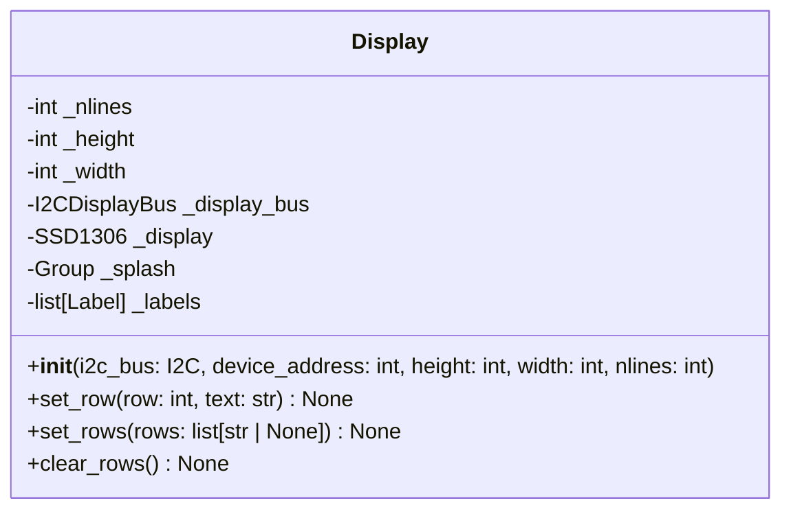
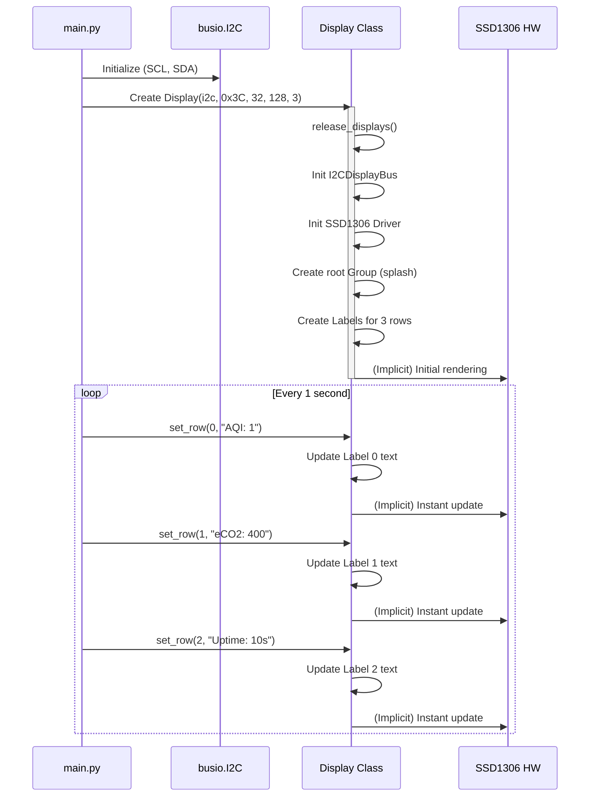

# `Display` Class Documentation

The `Display` class provides a high-level interface for managing an SSD1306 OLED display (128x32) using CircuitPython's `displayio` and `adafruit_displayio_ssd1306` library. It handles the initialization of the I2C display bus, the display driver, and the management of multiple text rows.

## Class Structure

The following class diagram illustrates the internal structure of the `Display` class, including its private attributes and public methods.

### Constructor

- **`Display(i2c_bus, device_address, height, width, nlines)`**:
    - `i2c_bus`: The initialized `busio.I2C` object.
    - `device_address`: The I2C address of the SSD1306 (typically `0x3C`).
    - `height`: Display height in pixels (e.g., `32`).
    - `width`: Display width in pixels (e.g., `128`).
    - `nlines`: Number of text rows to manage.

### Methods

- **`set_row(row: int, text: str)`**: Sets the text for a specific row (zero-indexed). Raises a `ValueError` if the row index is out of range.
- **`set_rows(rows: list[str | None])`**: Sets multiple rows at once. `None` values skip the corresponding row. Raises a `ValueError` if the list exceeds the number of lines.
- **`clear_rows()`**: Clears all text rows on the display.

---

## Typical Use Sequence

This sequence diagram shows a typical interaction between a main script (e.g., `main.py`) and the `Display` class, including initialization and periodic updates.

*(You can also view the standalone SVG version here: [display_sequence.svg](./images/display_sequence.svg))*

### Implementation Note
The `Display` class uses `displayio`, which handles automatic refresh. Therefore, updating a `Label` object's `text` attribute results in an instantaneous update to the physical display without needing an explicit `update()` or `refresh()` call.
